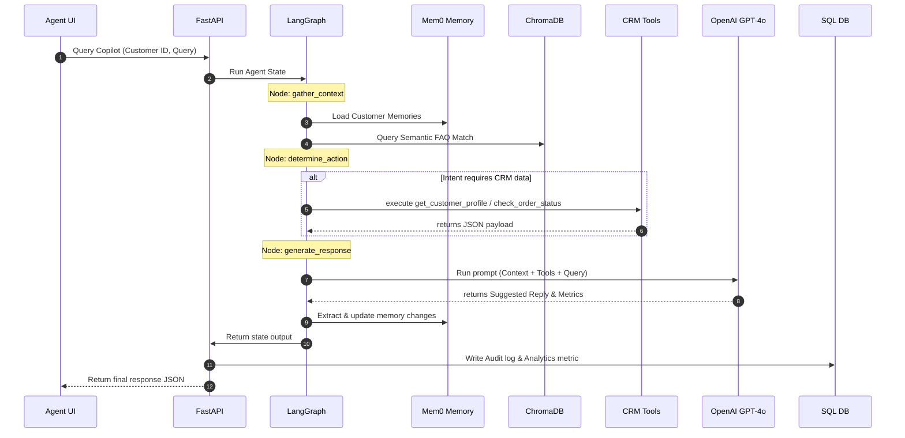
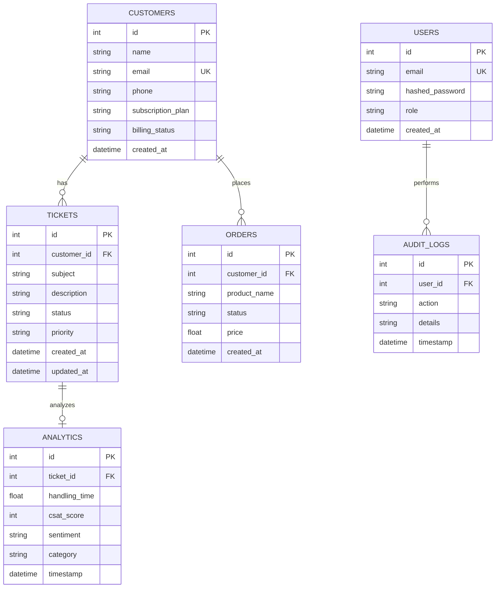

# Architectural Design Document

This document outlines the system architecture, ER schemas, and Agent workflows of the AI-Powered Customer Support Copilot CRM.

## 1. System Components
- **Dashboard UI (Next.js & Fallback HTML SPA)**: Renders the interface for the support agent, featuring active search dropdowns, order timelines, audit trails, and conversational inputs.
- **FastAPI Application Gateway**: Authenticates requests, exposes analytics dashboards, handles document uploads, and executes agent graph queries.
- **LangGraph Conversational Agent**: Resolves support intent, retrieves relevant context from databases, executes external API mocks via LangChain tools, and compiles replies.
- **ChromaDB Vector Store**: Indexes chunks of company policies (extracted using PyPDF) to run semantic similarity queries on customer inputs.
- **PostgreSQL Relational Storage**: Stores transaction records, ticket queues, admin credentials, audit logs, and memories.

---

## 2. Dynamic Workflow Execution

---

## 3. Database Entity-Relationship Model

